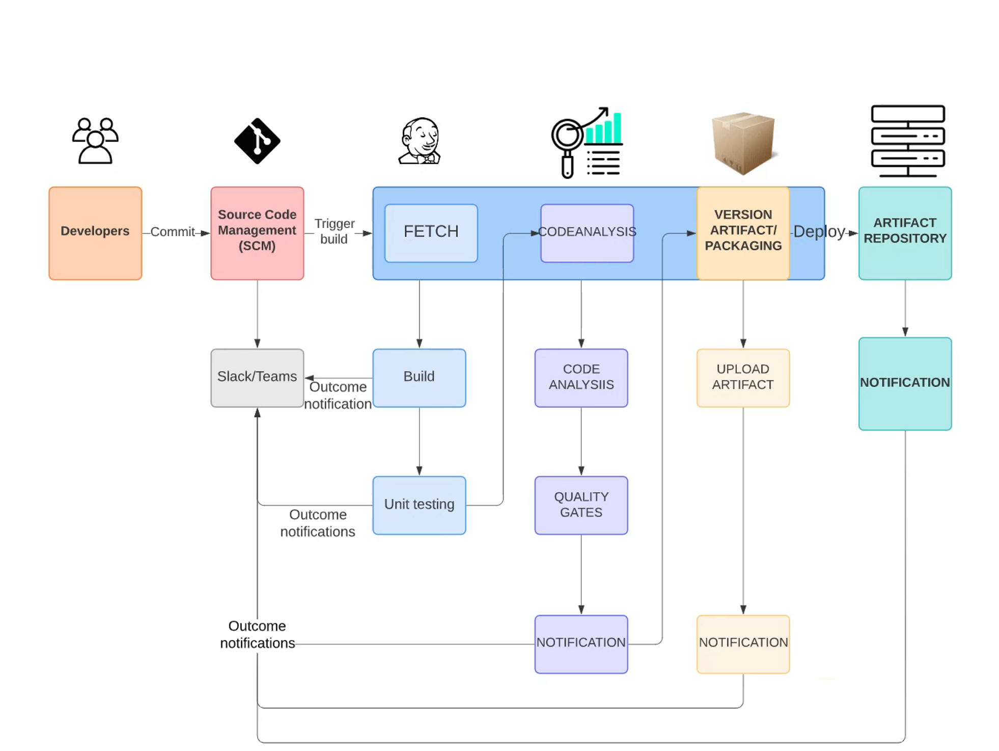
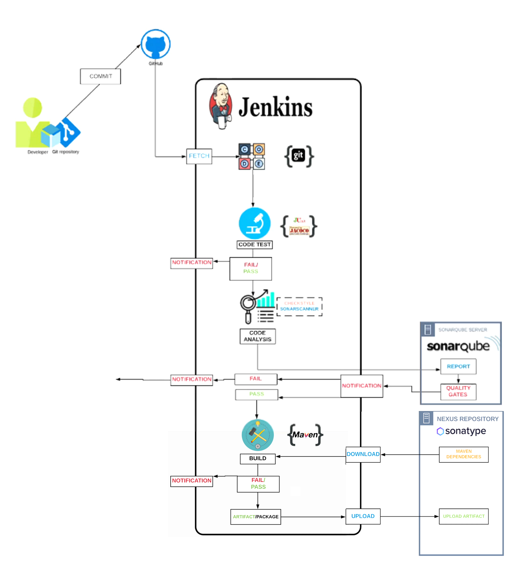

# Continuous Integration Using Jenkins, Nexus, Sonarqube & Slack

## Scenario
- Agile SDLC
- Developers make regular code changes.
- These commits needs to be Build & Tested.
- Usually Build & Release Team will do this job.
- Or Developers responsibility to merge and integrate code.

## Problem
Issus with current situation
- In an Agile SDLC, there will be frequent code changes.
- Not so frequently code will be tested.
- Which accumulates bugs and error in.
- Developers need to rework to fix these bugs and error.
- Manual Build & Release process.
- Inter Team Dependencies.

## Solution
- Build & Test for every commit.
- Automated process
- Notify for every build status.
- Fix code if bugs or error found instantly rather than waiting.
  
## Benefits
- CI Pipeline
  - Fault Isolation
  - Agile
  - Short MTTR (Min Time to Repair)
  - No Human Intervention

## Tools
- Jenkins (CI server)
- Git (Version Control System)
- Maven (Build Tool)
- Checkstyle (Code analysis tool)
- Slack (Notification)
- Nexus (Artifact/Software repository)
- Sonarqube (Code analysis server)
- AWS EC2 (Compute Resource)

## Objective
Goals
- Fault Isolation
- Short MTTR
- Fast turn around on feature changes
- Less Disruptive

## Architecture of CI Pipeline 
### Workflow

### Full Architecture

## Flow of execution
1. Login to AWS Account
2. Create key pair
3. Create Security Group
   - Jenkins, Nexus & Sonarqube
4. Create Ec2 Instances with userdata
   - Jenkins, Nexus & Sonarqube
5. Post installation
   - Jenkins setup & plugins
   - Nexus setup & repository setup
   - Sonarqube login test
6. Git
   - Create a github repository & migrate code
   - Integrate github repo with VsCode and test it
   - [Git repository](https://github.com/nizam754/vprociproject)
7. Build job with Nexus integration
8. Github webhook
9. Sonarqube server integration stage
10. Nexus Artifact upload stage
11. Slack Notification